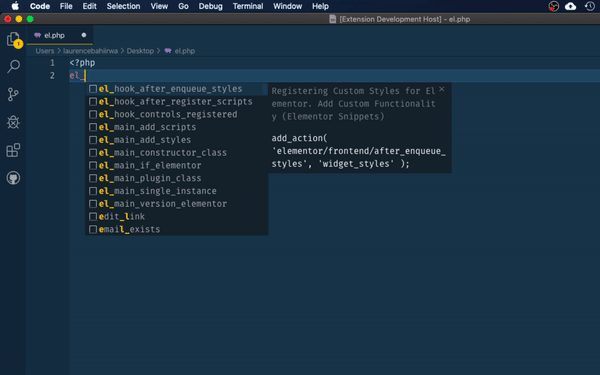

# Elementor Snippets

Code snippets to build Elementor Plugin widgets.

Classicpress Snippets is meant to help VS Code users to leverage snippets from ClassicPress and WordPress for Development. This is a personal project and not an official extension from ClassicPress.net.

### How to use

Type `el_` to see available autocompletions in work.

### Install instructions

Install via Extension Marketplace

-   Open Command on Visual Studio Code (Ctrl+Shift+P on Windows or Cmd+Shift+P on Mac/OSX)
-   > ext install elementor-snippet
-   Wait until install complete and restart VS Code

### Features

Autocomplete for:

| Added Code     | Number    | Trigger   |
| ---------------| :-------: | :-------: |
| Hooks          |    3      | el_hook   |
| Controls       |    1      | el_ctrl   |
| Categories     |    1      | el_cat    |
| Main Classes   |    7      | el_main   |

### Details

-   License: GPLv3
-   Version: 0.0.1
-   Extension URI: https://github.com/bahiirwa/elementor-snippets

## Known Issues

Known issues at avaialble at the [Github Repo](https://github.com/bahiirwa/elementor-snippets/issues)

-----------------------------------------------------------------------------------------------------------

## Release Notes

All notable changes to the "elementor-snippets" extension will be documented in here and in the details found in the changelog file.

## 0.0.1 [25.04.2020]

- Initial release

**Enjoy!**
